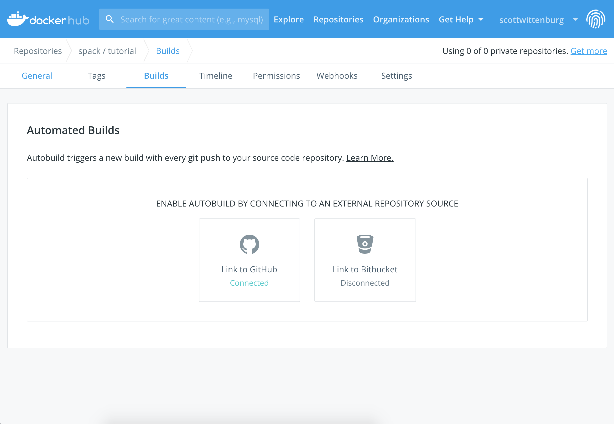
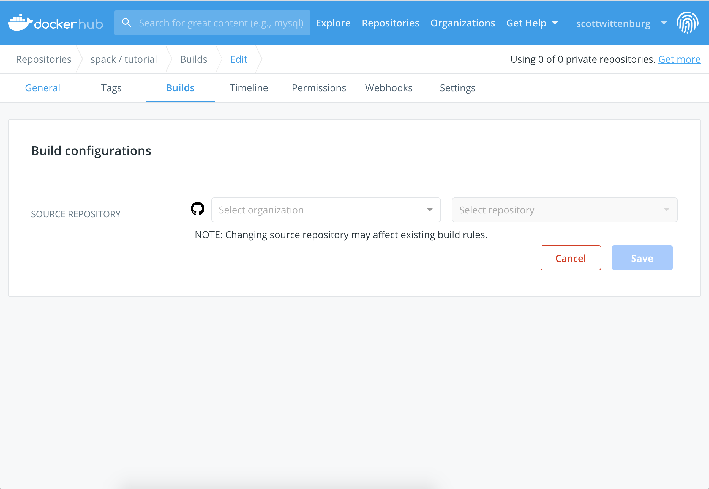
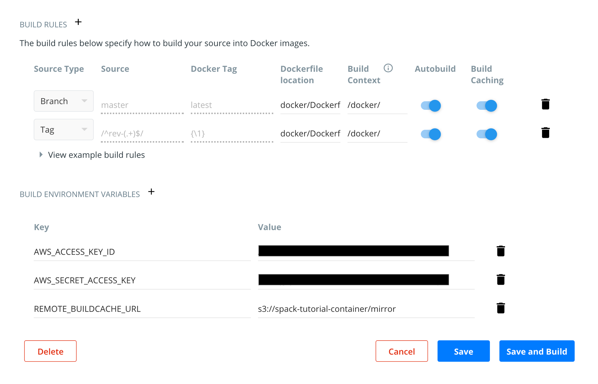

# DockerHub Automated Build Setup

This document describes how to set up the automated DockerHub container builds
which can build, tag, and push a Docker container with the contents of the
binary mirror populated by the Gitlab pipeline.

DockerHub provides information on autobuilds [here](https://docs.docker.com/docker-hub/builds/).

## Overview

DockerHub autobuilds can be set up to build either when you push to a specific
branch, or when you push a tag matching some criterion.  For the current case,
we are setting up one build to run every time the `master` branch is pushed
(in which case the resulting container will be tagged simply with `latest`), as
well as a build to detect when tags of a certain format are pushed.

Because we're accessing a spack mirror that lives in an AWS S3 bucket via a
specific `s3` url, we need to:

1. install the `boto3` module in the container
2. ensure AWS access credentials are available during container build

## Link your DockerHub repo to your GitHub repo

Navigate to your repository on DockerHub and login.  Then click on the `Builds`
tab and choose "Link to GitHub".

<kbd></kbd>

Now you have a chance to choose your organization and repository.

<kbd></kbd>

In our case, we disable auto testing and repository links, but you may want
those turned on for your automated builds.  You can more more about auto
tests [here](https://docs.docker.com/docker-hub/builds/automated-testing/).
Repository links allow you to trigger builds when your base image changes,
but only for non-official images.

<kbd></kbd>

## Configure builds

Configuring some autobuilds is a matter of adding a build rule for each kind of
event you want to trigger a build, and in our case, setting up some environment
variables you want to be available to the build process as `--build-arg` cli
args.

<kbd></kbd>

In the screenshot above, you can see we have set up two build rules.  The first
will trigger a build whenever we push to the `master` branch on our linked
GitHub repository.  The resulting Docker image will simply be tagged `latest`.
We have configured anoher build to be triggered upon certain tags.  Any tag
which starts with `rev-` will be noticed and autobuilt.  Anything in the tag
string after the `rev-`, will be captured and used as the image tag.  For example
if you wish your resulting container to be tagged `sc19`, you would tag the repo
`rev-sc19`.

Note also in the screenshot above we have specified the location of the Dockerfile
and build context, as well as some environment variables.  You can see how the
environment variables are used by looking at the `docker/hooks/build` file in this
repo, where we issue a `docker build ...` command to make use of them.
