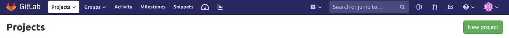
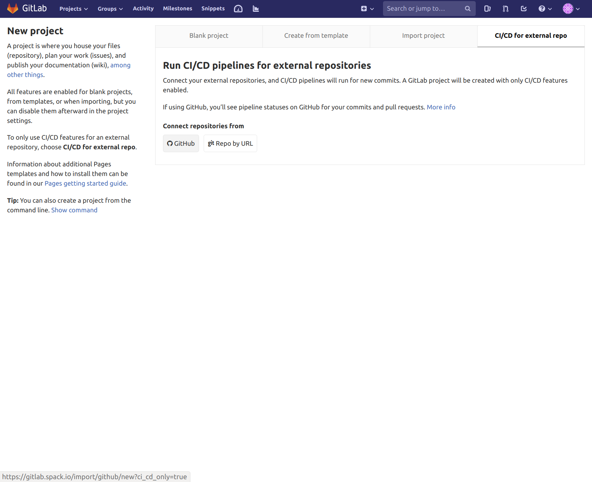
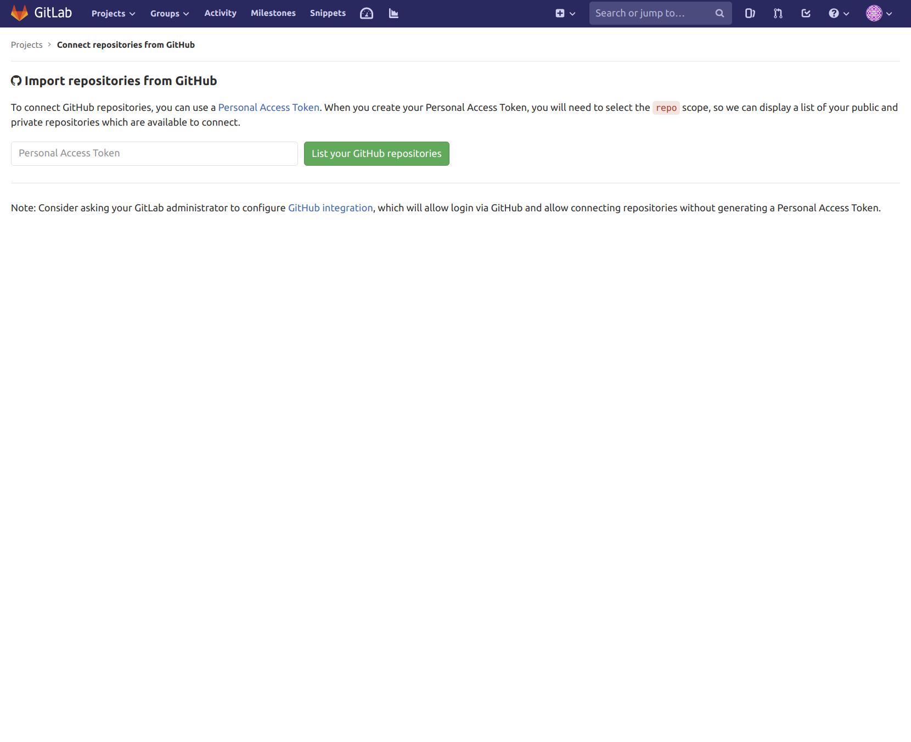
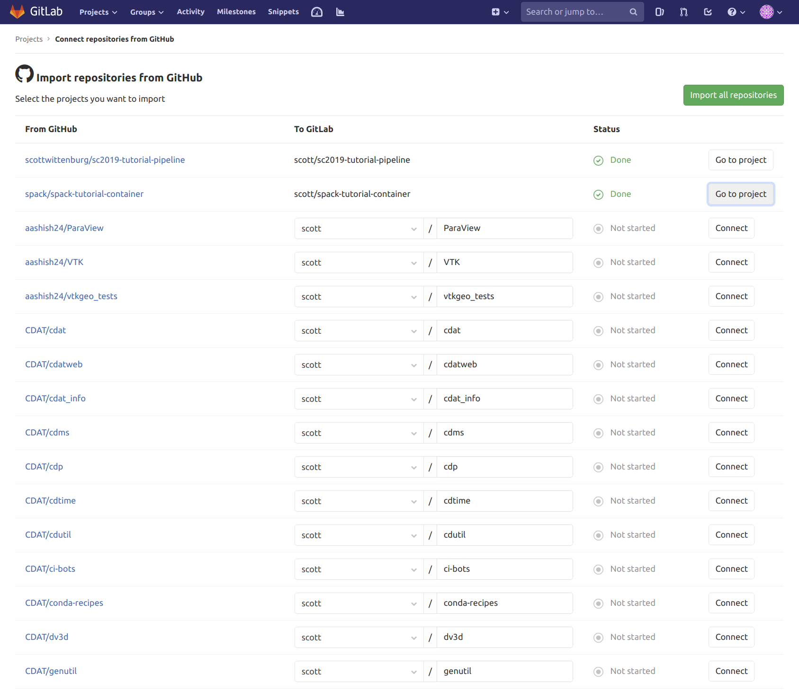
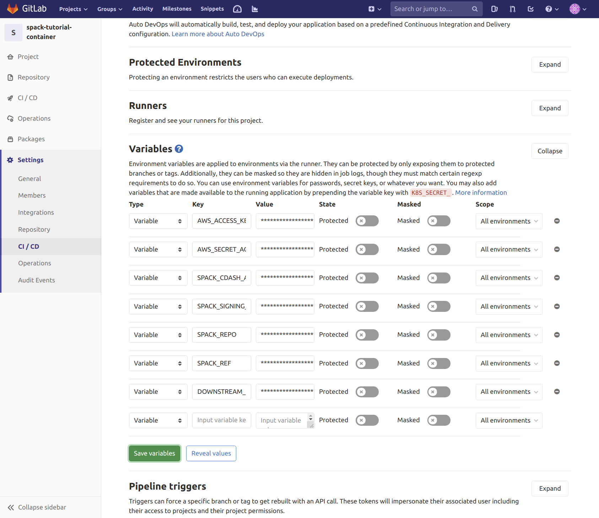
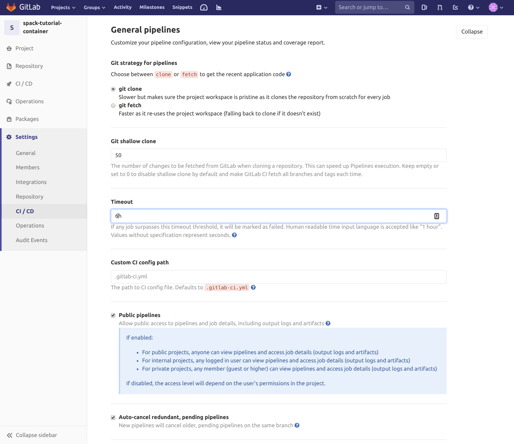
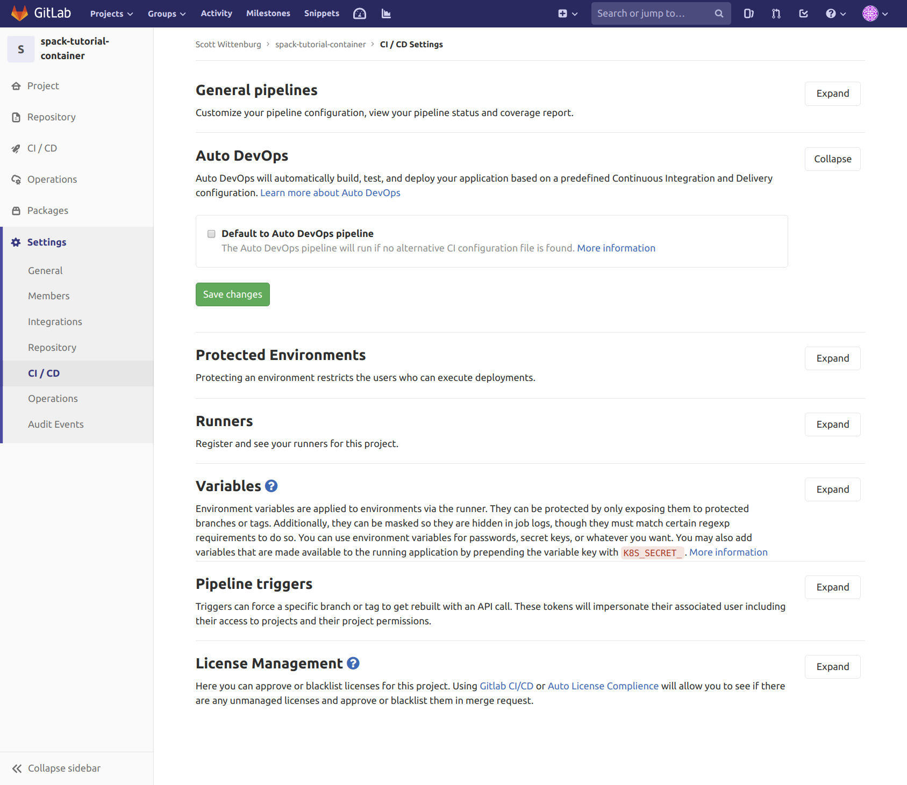
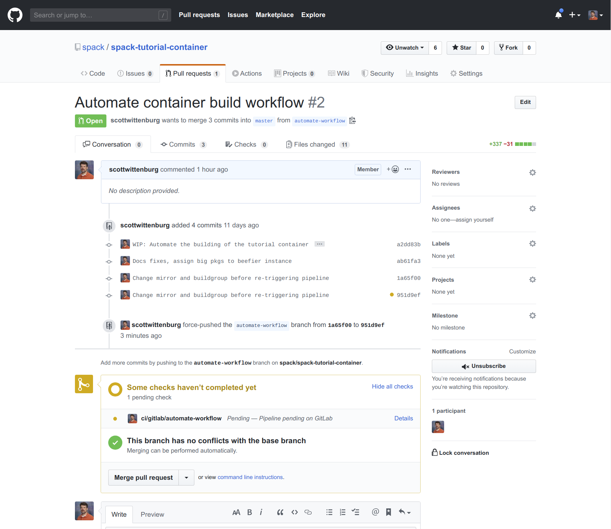
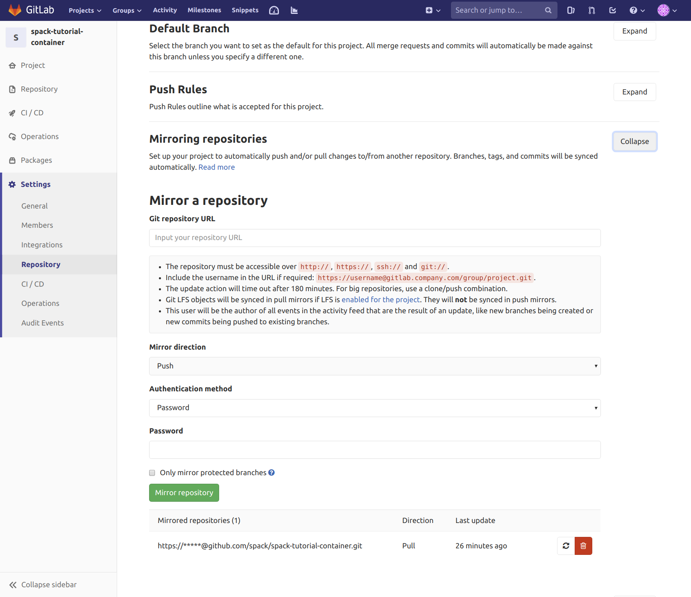

# Setting up the Gitlab CI/CD Repo

This document describes the steps required to setup a Gitlab project that
will run pipelines against an external GitHub repo whenever you make a
PR or push a commit on an open PR on that repo.  Gitlab provides some
documentation on the process as well, you can read that
[here](https://docs.gitlab.com/ee/ci/ci_cd_for_external_repos/).  At a high
level, this document covers creating the repository, linking to the desired
GitHub repo, and how to set up necessary environement variables.  It also
mentions some issues you may encounter as well as ways to work around them.

## Create the project

Start by navigating to your projects and clicking the green "New Project"
button near the upper right corner of the page.

<kbd></kbd>

Next click on the "CI/CD for external repo" tab, also located near the top
right of the page.  Then, under "Connect repositories from", click the
"GitHub" button.

<kbd></kbd>

For the next step you will need to have created a personal access token in
GitHub previously.  Paste that token into the field marked "Personal Access
Token", and then click the green button labeled "List your GitHub repositories".

<kbd></kbd>

On the next page you should see a list of all the repositories under all
organizations to which you have access.  Find the project you want Gitlab
to mirror and run pipelines for, and then click its "Connect" button in the
right column.

<kbd></kbd>

At this point, you can move on to configuring settings in the new Gitlab
CI/CD repository.

## Configure the project settings

This section guides you through configuring various project settings.

### Variables

The most important configuration requirement is to set up the necessary
CI/CD variables your automated pipelines will need.  The spack [pipelines
documentation](https://spack.readthedocs.io/en/latest/pipelines.html#environment-variables-affecting-pipeline-operation)
describes the individual variables in more detail.

<kbd></kbd>

### General pipelines

To make sure your packages have enough time to build before Gitlab cancels
the job, you probably want to extend the job timeout.  You may also want to
change how Gitlab gets your project (choose "clone" so the repo is in a
fresh state for every job).  These settings can be found under the CI/CD
section of your project settings after you expand the "General Pipelines"
section.

<kbd></kbd>

### Auto DevOps

Since you'll be providing a valid CI configuration file, it is safe and
removes clutter from your pipelines to disable "Auto DevOps".  To do this
(optional), navigate to the CI/CD section of your project settings and
expand the "Auto DevOps" section.  Uncheck the box labeled "Default to
Auto DevOps pipeline", and click the "Save Changes" button.

<kbd></kbd>

## Creating a PR on GitHub

At this point your Gitlab CI/CD project is set up for running pipelines
against your external GitHub repository.  To actually have it run a
pipeline, you need to create a PR on the GitHub repo.  Normally the
GitHub repo will contain a simple `.gitlab-ci.yml` file as well as a
`spack.yaml` (a spack environement) you want to build.  Those files are
described in more detail in this
[section](https://spack.readthedocs.io/en/latest/pipelines.html#a-pipeline-enabled-spack-environment)
of the spack pipelines documentation.

Once Gitlab has noticed your PR (or pushed commit to a PR branch) and started
a pipeline for you, it will also create a status check on your GitHub PR.

<kbd></kbd>

## Miscellaneous Issues

One issue you will encounter is related to how spack generates a pipeline
in a "pre-ci" phase.  Until Gitlab provides the ability to dynamically
generate child pipelines, spack is relying on pushing a commit with the
generated workload to a `DOWNSTREAM_CI_REPO` (usually the same repo, but
it's up to you).  So as soon as the "pre-ci" phase (job generation) completes
successfully, Gitlab will report success to your PR, and it will become
mergeable (not ideal, since the main workflow of building all your environment
specs very likely hasn't completed).

Another issue is that sometimes it seems to take Gitlab awhile to notice your
new PR or a commit you've pushed to a PR branch.  If this happens, you can try
asking Gitlab to refresh the mirrored repository manually.  To do this,
navigate to the "Repository" section of your Gitlab project settings and expand
the "Mirroring repositories" section. At the bottom of that section, you should
find your linked external GitHub repo, and on the right is a button allowing
you to "Update now".

<kbd></kbd>
